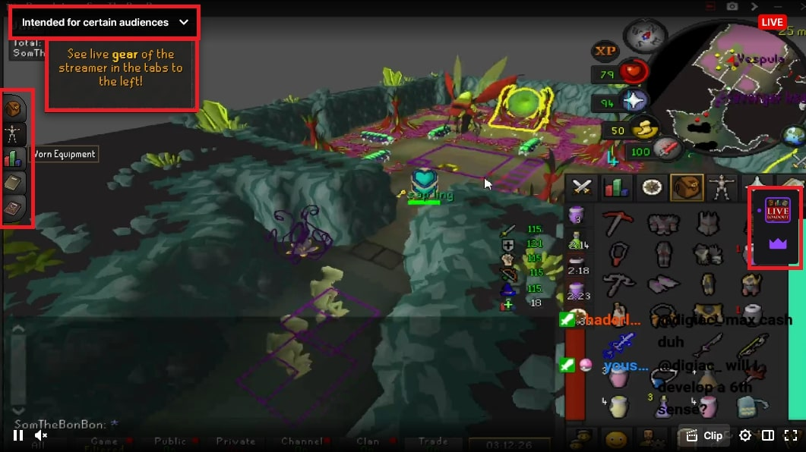

# Hides annoying twitch overlays

Got tired of visual clutter on twitch streams so I made this TamperMonkey script.

> [!Note]
> No clue if it works on all overlays

# Requirements 
- Browser Extension for managing UserScripts  
   - Chrome: [Violentmonkey][chrome_violentmonkey] or [Tampermonkey][chrome_tampermonkey]
   - Firefox: [Greasemonkey][firefox_greasemonkey], [Tampermonkey][firefox_tampermonkey], or [Violentmonkey][firefox_violentmonkey]  
   - Opera: [Tampermonkey][opera_tampermonkey] or [Violentmonkey][opera_violentmonkey]
   - Brave: [Violentmonkey][chrome_violentmonkey] or [Tampermonkey][chrome_tampermonkey]
   - Edge: [Tampermonkey][edge_tampermonkey]
- `hide_twitch_overlays_script.js` file

# Before

# After

[chrome_violentmonkey]: https://chrome.google.com/webstore/detail/violent-monkey/jinjaccalgkegednnccohejagnlnfdag
[chrome_tampermonkey]: https://chrome.google.com/webstore/detail/tampermonkey/dhdgffkkebhmkfjojejmpbldmpobfkfo
[firefox_greasemonkey]: https://addons.mozilla.org/firefox/addon/greasemonkey/
[firefox_tampermonkey]: https://addons.mozilla.org/firefox/addon/tampermonkey/
[firefox_violentmonkey]: https://addons.mozilla.org/firefox/addon/violentmonkey/
[safari_tampermonkey]: https://github.com/victornpb/undiscord/issues/91#issuecomment-654514364
[edge_tampermonkey]: https://microsoftedge.microsoft.com/addons/detail/tampermonkey/iikmkjmpaadaobahmlepeloendndfphd
[opera_tampermonkey]: https://addons.opera.com/extensions/details/tampermonkey-beta/
[opera_violentmonkey]: https://addons.opera.com/extensions/details/violent-monkey/